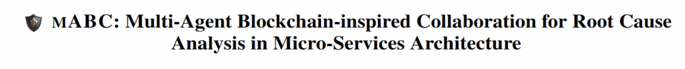
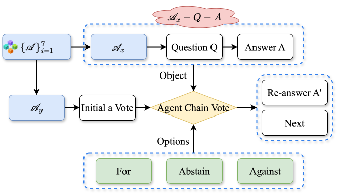
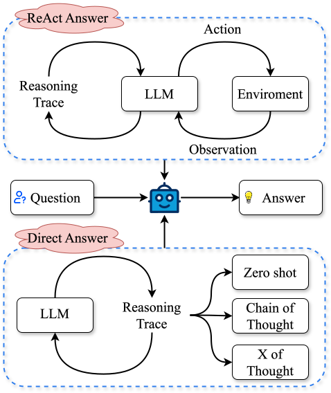
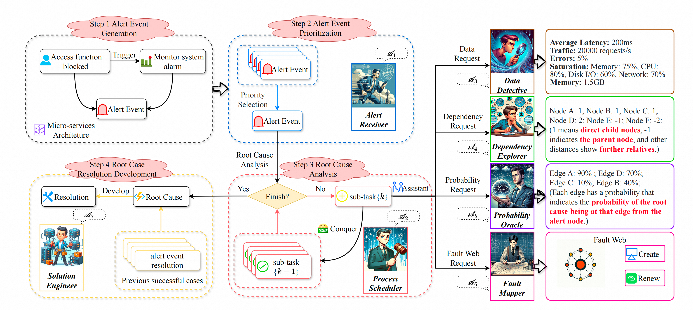

<div align= "center">
    <h1>  mABC</h1>
</div>

## Aviso
¡Atención! Hemos proporcionado un archivo de datos de muestra guardado en la carpeta `simple_sample` para que pueda procesar sus datos en un formato similar y disfrutar de **mABC**!

## Resumen
La complejidad creciente de la arquitectura de microservicios en tecnologías nativas de la nube plantea importantes desafíos para mantener la estabilidad y eficiencia del sistema. Para realizar el análisis de causa raíz (RCA) y la resolución de eventos de alerta, proponemos un marco pionero, **m**ulti-**A**gente **B**loque-cadena inspirado en **C**olaboración para el análisis de causa raíz en arquitectura de microservicios (**mABC**), para revolucionar el dominio de la inteligencia artificial para operaciones de TI (AIOps), donde múltiples agentes basados en los poderosos modelos de lenguaje grandes (LLMs) realizan una votación inspirada en blockchain para alcanzar un acuerdo final siguiendo un proceso estandarizado para el procesamiento de tareas y consultas proporcionadas por *Agent Workflow*. Específicamente, siete agentes especializados derivados de *Agent Workflow* proporcionan información valiosa para el análisis de causa raíz basándose en su experiencia y el conocimiento intrínseco del software de los LLMs que colaboran dentro de una cadena descentralizada. Para evitar posibles problemas de inestabilidad en los LLMs y aprovechar plenamente las ventajas transparentes y egualitarias inherentes a una estructura descentralizada, mABC adopta un proceso de toma de decisiones inspirado en los principios de gobernanza de blockchain, al tiempo que considera el índice de contribución y el índice de experiencia de cada agente. Los resultados experimentales en el conjunto de datos de referencia público del desafío AIOps y nuestro conjunto de datos creado de boletos de tren demuestran un rendimiento superior en la identificación precisa de causas raíz y la formulación de soluciones efectivas, en comparación con las líneas base fuertes anteriores. El estudio de ablación destaca aún más la importancia de cada componente dentro de mABC, con *Agent Workflow*, multi-agente y la votación inspirada en blockchain siendo cruciales para lograr un rendimiento óptimo. mABC ofrece un análisis de causa raíz y resolución automatizados integrales en arquitectura de microservicios y logra una mejora significativa en el dominio AIOps en comparación con las líneas base existentes.


## Descripción general
<center>
    
    <br>
    <div style="color:orange; border-bottom: 1px solid #d9d9d9;
    display: inline-block;
    color: #999;
    padding: 2px;"></div>
</center>
<!-- 

 -->

<center>
    
    <br>
    <div style="color:orange; border-bottom: 1px solid #d9d9d9;
    display: inline-block;
    color: #999;
    padding: 2px;">Descripción general de mABC. El flujo general encapsula el proceso desde el inicio de la alerta hasta el análisis de causa raíz dentro de mABC.</div>
</center>

<center>
    
    <br>
    <div style="color:orange; border-bottom: 1px solid #d9d9d9;
    display: inline-block;
    color: #999;
    padding: 2px;">Dos flujos de trabajo distintos del agente. La respuesta ReAct implica un ciclo iterativo de pensamiento, acción y observación hasta que se alcanza una respuesta satisfactoria, mientras que las respuestas se formulan directamente según el prompt proporcionado siguiendo la respuesta directa.</div>
</center>

<center>
    
    <br>
    <div style="color:orange; border-bottom: 1px solid #d9d9d9;
    display: inline-block;
    color: #999;
    padding: 2px;">Proceso de votación en la Cadena de Agentes</div>
</center>

## Entorno y Ejecución

### Versión impulsada por OpenAI

1. entorno de python:

```
pip install -r requirements.txt
```

2. defina su OPENAI_API_KEY y la tarea.

```
export OPENAI_API_KEY="sk-xxx"
```

3. ejecute el script según su tarea, ejemplo:

```
python main/main.py
```

### Versión impulsada por LLM alternativo

Intente reemplazar `utils/llm.py`.


## Aviso
Siéntase libre de citarnos si le gusta mABC, y puede contactarme a zwpride@buaa.edu.cn.

```
@inproceedings{zhang-etal-2024-mabc,
    title = "m{ABC}: Multi-Agent Blockchain-inspired Collaboration for Root Cause Analysis in Micro-Services Architecture",
    author = "Zhang, Wei  and
      Guo, Hongcheng  and
      Yang, Jian  and
      Tian, Zhoujin  and
      Zhang, Yi  and
      Chaoran, Yan  and
      Li, Zhoujun  and
      Li, Tongliang  and
      Shi, Xu  and
      Zheng, Liangfan  and
      Zhang, Bo",
    editor = "Al-Onaizan, Yaser  and
      Bansal, Mohit  and
      Chen, Yun-Nung",
    booktitle = "Findings of the Association for Computational Linguistics: EMNLP 2024",
    month = nov,
    year = "2024",
    address = "Miami, Florida, USA",
    publisher = "Association for Computational Linguistics",
    url = "https://aclanthology.org/2024.findings-emnlp.232",
    pages = "4017--4033",
    abstract = "Root cause analysis (RCA) in Micro-services architecture (MSA) with escalating complexity encounters complex challenges in maintaining system stability and efficiency due to fault propagation and circular dependencies among nodes. Diverse root cause analysis faults require multi-agents with diverse expertise. To mitigate the hallucination problem of large language models (LLMs), we design blockchain-inspired voting to ensure the reliability of the analysis by using a decentralized decision-making process. To avoid non-terminating loops led by common circular dependency in MSA, we objectively limit steps and standardize task processing through Agent Workflow. We propose a pioneering framework, multi-Agent Blockchain-inspired Collaboration for root cause analysis in micro-services architecture (mABC), where multiple agents based on the powerful LLMs follow Agent Workflow and collaborate in blockchain-inspired voting. Specifically, seven specialized agents derived from Agent Workflow each provide valuable insights towards root cause analysis based on their expertise and the intrinsic software knowledge of LLMs collaborating within a decentralized chain. Our experiments on the AIOps challenge dataset and a newly created Train-Ticket dataset demonstrate superior performance in identifying root causes and generating effective resolutions. The ablation study further highlights Agent Workflow, multi-agent, and blockchain-inspired voting is crucial for achieving optimal performance. mABC offers a comprehensive automated root cause analysis and resolution in micro-services architecture and significantly improves the IT Operation domain.",
}
```
