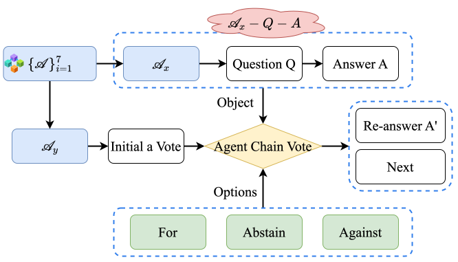
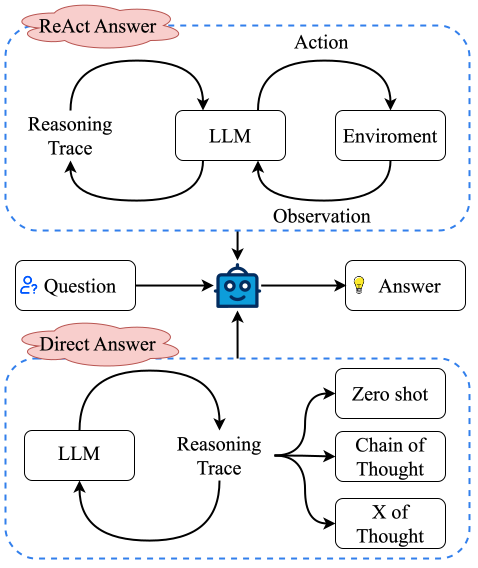
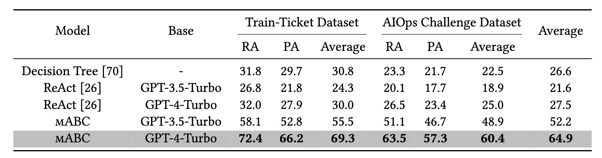
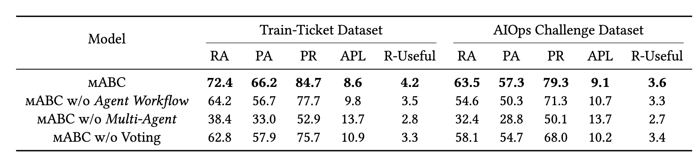

<div align= "center">
    <h1>  mABC</h1>
</div>

## Notice
We will release more data in this repository as soon as possible. 

## Abstract
The escalating complexity of micro-services architecture in cloud-native technologies poses significant challenges for maintaining system stability and efficiency. To conduct root cause analysis (RCA) and resolution of alert events, we propose a pioneering framework, **m**ulti-**A**gent **B**lockchain-inspired **C**ollaboration for root cause analysis in micro-services architecture (**mABC**), to revolutionize the AI for IT operations (AIOps) domain, where multiple agents based on the powerful large language models (LLMs) perform blockchain-inspired voting to reach a final agreement following a standardized process for processing tasks and queries provided by *Agent Workflow*. Specifically, seven specialized agents derived from *Agent Workflow* each provide valuable insights towards root cause analysis based on their expertise and the intrinsic software knowledge of LLMs collaborating within a decentralized chain. To avoid potential instability issues in LLMs and fully leverage the transparent and egalitarian advantages inherent in a decentralized structure, mABC adopts a decision-making process inspired by blockchain governance principles while considering the contribution index and expertise index of each agent. Experimental results on the public benchmark AIOps challenge dataset and our created train-ticket dataset demonstrate superior performance in accurately identifying root causes and formulating effective solutions, compared to previous strong baselines. The ablation study further highlights the significance of each component within mABC, with *Agent Workflow*, multi-agent, and blockchain-inspired voting being crucial for achieving optimal performance. mABC offers a comprehensive automated root cause analysis and resolution in micro-services architecture and achieves a significant improvement in the AIOps domain compared to existing baselines.


## Overview

<!-- 

 -->

<center>
    
    <br>
    <div style="color:orange; border-bottom: 1px solid #d9d9d9;
    display: inline-block;
    color: #999;
    padding: 2px;">Overview of mABC. Overall pipeline encapsulates the flow from alert inception to root cause analysis within mABC.</div>
</center>

<center>
    
    <br>
    <div style="color:orange; border-bottom: 1px solid #d9d9d9;
    display: inline-block;
    color: #999;
    padding: 2px;">Two distinct workflows of agent. ReAct answer involves an iterative cycle of thought, action, and observation until a satisfactory answer is reached, while responses are directly formulated based on the prompt provided following the direct answer.</div>
</center>

<center>
    
    <br>
    <div style="color:orange; border-bottom: 1px solid #d9d9d9;
    display: inline-block;
    color: #999;
    padding: 2px;">Vote process on Agent Chain</div>
</center>


## Result
<center>
    
    <br>
    <div style="color:orange; border-bottom: 1px solid #d9d9d9;
    display: inline-block;
    color: #999;
    padding: 2px;">Main Results</div>
</center>

<center>
    
    <br>
    <div style="color:orange; border-bottom: 1px solid #d9d9d9;
    display: inline-block;
    color: #999;
    padding: 2px;">Component Impact Evaluation</div>
</center>

## Enviornment and Running

1. python enviornment:

```
pip install -r requirements.txt
```

2. define your OPENAI_API_KEY and task.

```
export OPENAI_API_KEY="sk-xxx"
```

3. run script follow your task, example:

```
cd main
python main.py
```


## Notice
Feel free to cite us if you like mABC, and you can contact me by knediny@gmail.com.

```
@article{zhang2024mabc,
  title={mABC: multi-Agent Blockchain-Inspired Collaboration for root cause analysis in micro-services architecture},
  author={Zhang, Wei and Guo, Hongcheng and Yang, Jian and Zhang, Yi and Yan, Chaoran and Tian, Zhoujin and Ji, Hangyuan and Li, Zhoujun and Li, Tongliang and Zheng, Tieqiao and others},
  journal={arXiv preprint arXiv:2404.12135},
  year={2024}
}
```
